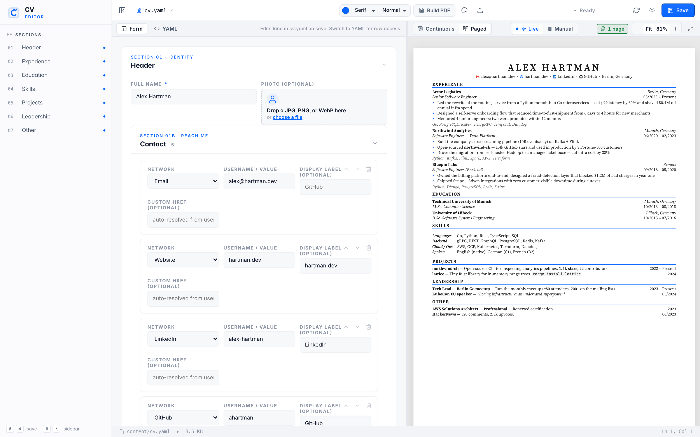
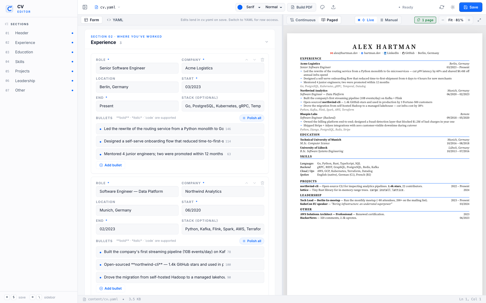
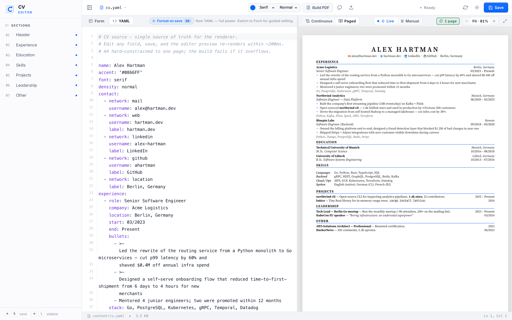
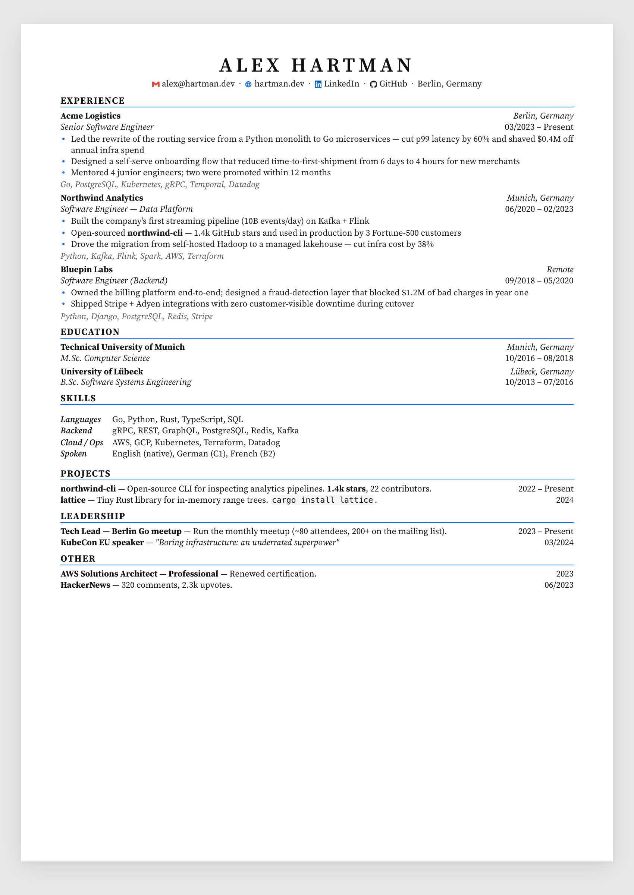
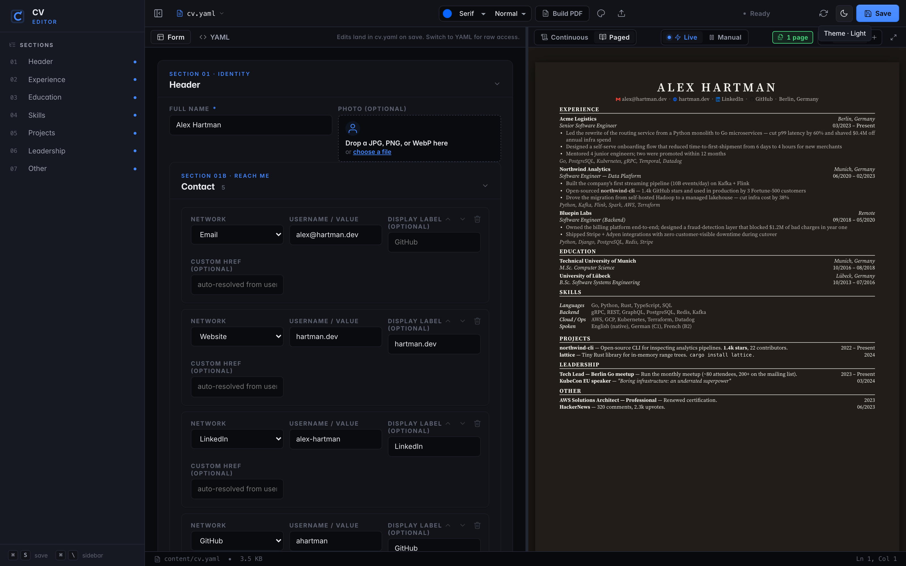

<div align="center">

# OnePager

### A live one-page CV editor that **fails the build** if you overflow.

[](LICENSE)
[](https://www.python.org)
[](#testing)
[](#one-page-enforced)
[](https://www.anthropic.com)

**Form on the left. Live A4 on the right. One page — or it doesn't ship.**

[Run it](#run-it) · [Why](#why-this-exists) · [Features](#features) · [Customise](#customise) · [Compared to](#compared-to)



</div>

---

## Why this exists

Most CV tools fail in one of four ways. Word fights you on every paragraph. Figma is pixel-pushing in disguise. LaTeX is a weekend. YAML-only renderers like `rendercv` get the data model right but the feedback loop is *render → open PDF → sigh → edit → render again*.

**This is the missing middle.** A local editor with a structured form on the left and a paged.js preview on the right, hard-constrained to one A4 page. Drop a PDF or DOCX in and Claude maps it into the schema in about five seconds. Edit in the form. The preview re-renders in 250 ms; autosave fires at 1.5 s idle. Push past one page and the second page outlines red. The build refuses to ship a two-pager.

A CV is a small document with a brutal constraint: one page, A4, in a layout convention every reader has internalised. **The one-page rule is load-bearing.** The build refuses to produce a two-page PDF. The editor outlines the second page in red the moment a bullet pushes you over. Everything else — the densities, the fonts, the brand icons, the AI extract, the themes — is in service of that single constraint.

---

## Run it

```bash
git clone https://github.com/your-handle/onepager.git
cd onepager
pip install -r requirements.txt

# Render a PDF
python3 engine/build.py
open output/cv.pdf

# Or edit interactively
python3 tools/editor/server.py
# → http://127.0.0.1:5567
```

**Optional:** AI-powered import (Claude with prompt caching).

```bash
export ANTHROPIC_API_KEY="sk-ant-…"
python3 tools/editor/server.py
```

Six steps from clone to shipped PDF:

1. `pip install -r requirements.txt`
2. `python3 tools/editor/server.py` → open `http://127.0.0.1:5567`
3. Click **Import**, drop your existing PDF, wait ~5 s.
4. Review the parsed form — every field has a labelled input.
5. Edit. Save fires after 1.5 s idle. Preview redraws in 250 ms.
6. `python3 engine/build.py` → `output/cv.pdf`. **One page or it fails.**

---

## Features

<table>
<tr>
<td width="50%">

### One-file source of truth
`content/cv.yaml`. Version-control it. Diff it. Bring it to the next CV refresh in two years and skip Word entirely.

### Live A4 preview
paged.js renders the same layout WeasyPrint will print. **What you see is what ships.** A green pill says *1 page*. The instant you overflow, it shakes red.

### Form-first editor
Cards animate in and out. Up/down/delete on every list. Cmd+S to save. Cmd+Z to undo across the whole model. No JSON-edits-in-disguise.

</td>
<td width="50%">

### AI import in 5 seconds
Drop a PDF, DOCX, or paste resume text. Claude maps it into the schema. The system prompt is wrapped in `cache_control: ephemeral`, so subsequent imports cost ~10% of the first one.

### Themes as JSON
`themes/<name>.json` — `{ name, accent, font, density }`. The editor's Theme picker lists everything in the folder. Drop a JSON in, restart, done.

### Brand-coloured contact icons
LinkedIn blue, GitHub near-black, Gmail-style red. 17 networks plus mail/phone/web/location. The contact line auto-resolves URLs from a handle.

</td>
</tr>
</table>

---

## The loop



The editor is two panes. The form on the left renders directly from `content/cv.yaml`. Cards animate in and out as you add or remove entries. Every list — experience, education, skills, projects, leadership, others — has the same shape: card per item, fields inside, up/down/delete in the corner.

The preview on the right is paged.js running inside an iframe. It uses the same CSS WeasyPrint will use for the print build, so what you see is what ships. A status pill in the preview header shows the page count; it's green at one page, red the moment a bullet bumps you to two.

There's a **YAML** tab for the moments you'd rather edit text. The form and the file stay in sync — switching tabs round-trips through the same in-memory model.



---

## One page, enforced

This is the whole point.

**Build-time.** `python3 engine/build.py` runs WeasyPrint to PDF, counts pages, and exits non-zero if there's more than one:

```
❌ CV overflowed to 2 pages.
   First section on the overflow page: 'Education'.
   Try: --density tight, or trim a bullet in content/cv.yaml.
```

The overflow heading comes from walking WeasyPrint's bookmark tree to find the first heading whose target page index > 0. **You always know which section pushed it over.**

**Editor-time.** Toggle **Paged** mode in the preview header. paged.js paginates inside the iframe live. Any page after the first gets a 4-px red outline; the page-count pill goes from green `1 page` to red `Overflow · 2 pages` with a one-shot shake. **You see the moment a bullet pushes you over.**

To recover, in order of impact:

1. Switch density to **tight** (saves ~12% vertical space)
2. Trim adjectives, favour numbers (`50%+`, `100+ hours/week`)
3. Remove or merge older entries
4. As a last resort, drop the `stack:` line on older roles

---

## Themes


A theme is a four-field JSON file:

```json
{
  "name": "Linear Blue",
  "accent": "#5e6ad2",
  "font": "sans",
  "density": "normal"
}
```

Drop it into `themes/`. The editor picks it up on next reload. Click → it's applied. Ships with **Default**, **Forest**, **Harvard Crimson**, **Linear Blue**, and **Monochrome Tight**. Steal one, fork it, share yours back.

---

## Bring your own resume

Three import paths in one modal:

- **AI extract** — drop a PDF, DOCX, or paste any resume text. Claude (Sonnet 4.5) maps it into the schema. The system prompt is cached, so subsequent extractions cost ~10% of the first one. Without `ANTHROPIC_API_KEY`, the badge flips to **fallback** and a regex parser does its best.
- **rendercv YAML** — deterministic conversion from the format at [rendercv.com](https://rendercv.com). Brand-icon hints attached automatically.
- **Plain text** — paste any resume text. Heuristic regex parser detects sections, date ranges, "Company — Role · Location" headers, bullets.

PDF text extraction uses `pypdf`; DOCX uses a stdlib `zipfile` + XML parse — no heavy dependencies.

> **Coming from LinkedIn?** Open your profile → **More** → **Save to PDF**, then drop the file into the AI extract tab. The PDF flow handles it.

---

## Schema



The form writes this for you. Useful when you need raw access:

```yaml
name: Alex Hartman
accent: '#0866FF'           # bullet dots, section rules, accent text
font: serif                 # serif | sans | mono — sans uses Inter
density: normal             # tight | normal | airy

contact:
  - { network: mail,     username: alex@hartman.dev }
  - { network: web,      username: hartman.dev,    label: hartman.dev }
  - { network: linkedin, username: alex-hartman,   label: LinkedIn }
  - { network: github,   username: ahartman,       label: GitHub }
  - { network: location, label: Berlin, Germany }

experience:
  - role: Senior Software Engineer
    company: Acme Logistics
    location: Berlin, Germany
    start: 03/2023
    end: Present
    bullets:
      - Led the rewrite of the routing service from a Python monolith to Go microservices — cut p99 latency by 60%
      - Mentored 4 junior engineers; two were promoted within 12 months
    stack: Go, PostgreSQL, Kubernetes, gRPC, Temporal, Datadog

education:
  - degree: M.Sc. Computer Science
    school: Technical University of Munich
    location: Munich, Germany
    start: 10/2016
    end: 08/2018

skills:
  - { label: Languages, items: 'Go, Python, Rust, TypeScript, SQL' }
  - { label: Backend,   items: 'gRPC, REST, GraphQL, PostgreSQL, Redis, Kafka' }

projects:    [ { title, date, desc } ]
leadership:  [ { title, date, desc } ]
others:      [ { title, date, desc } ]
```

`**bold**`, `*italic*`, and `` `code` `` are supported in any free-text string. HTML is escaped. Section render order is fixed: Experience → Education → Skills → Projects → Leadership → Other. Empty sections are silently skipped.

### Supported `network:` values

`mail` · `phone` · `web` · `linkedin` · `github` · `gitlab` · `x` · `mastodon` · `bluesky` · `instagram` · `youtube` · `telegram` · `whatsapp` · `reddit` · `stackoverflow` · `leetcode` · `orcid` · `googlescholar` · `researchgate` · `imdb` · `location`

Each one auto-resolves the URL from `username`; pass an explicit `href:` to override. Aliases (`twitter` → `x`, `scholar` → `googlescholar`, `email` → `mail`) work too.

---

## Compared to

| | **OnePager** | rendercv | Word / Pages | LaTeX |
|---|---|---|---|---|
| Editing model | **Structured form + live A4 preview** | YAML + CLI | Free-form WYSIWYG | Source + recompile |
| Feedback loop | **~250 ms in browser** | Render → open PDF | Instant but unreliable | Seconds, full rebuild |
| One-page guarantee | **Build fails on overflow** | Manual | Manual | Manual |
| Data portability | **YAML, versionable** | YAML, versionable | `.docx` binary | `.tex` source |
| Imports an existing CV | **PDF / DOCX / text → Claude → schema** | None | Manual retype | Manual retype |
| Time to first PDF | **One command** | One command | 10–30 min layout fight | Hours, then templates |
| Themes | 1 × 3 densities × 3 fonts × N JSON | 9 themes | Infinite, all yours to break | Many, none yours to debug |

If you need many academic themes, use `rendercv`. If you want **the fastest possible feedback loop on a single tech-CV format**, use this. They share the YAML mindset; you can move data between them.

---

## Customise

The whole pipeline is one Python package, one Flask server, and a few hundred lines of CSS. **Two single-source-of-truth registries do most of the work:**

- **Sections** live in [`engine/render/sections.py`](engine/render/sections.py). To add a "Publications" section, append a `SectionDef` — done. The PDF, the form, the validator, the importer, and the Claude prompt all read from this list.
- **Themes** live in [`themes/`](themes/). One JSON per theme: `{ name, accent, font, density }`.

See [**EXTENDING.md**](EXTENDING.md) for the 30-second recipe to add a section, ship a theme, or change the typography.

> **Want Claude to make the change for you?** `git clone` the repo, point Claude Code at it, and ask. There's a [`CLAUDE.md`](CLAUDE.md) at the root that tells any coding agent exactly which files to edit (and which not to touch). The one-page guarantee, the form-first flow, and the live preview survive any extension — they're the load-bearing parts; the rest is yours.

---

## File layout

```
onepager/
├── content/cv.yaml             ← edit this (or use the form)
├── design/fonts/               ← Inter + Source Serif 4 (TTF)
├── engine/
│   ├── build.py                ← CLI: cv.yaml → cv.pdf
│   └── render/
│       ├── content.py          ← YAML loader + validation
│       ├── markdown_inline.py  ← inline **bold** / *italic* / `code`
│       ├── brand_icons.py      ← inline SVG paths + URL templates
│       ├── importers.py        ← rendercv YAML + plain text → cv.yaml
│       ├── ai_extract.py       ← Claude API extraction + PDF/DOCX text
│       ├── css_base.py         ← A4 typography, density variants
│       ├── sections.py         ← single source of truth for sections
│       └── templates.py        ← header/section/experience/… builders
├── tools/editor/
│   ├── server.py               ← Flask :5567
│   ├── render_preview.py       ← continuous + paged modes
│   └── static/
│       ├── index.html
│       ├── app.js              ← view toggle, paged.js coord, save loop
│       ├── form.js             ← form rendering + WAAPI animations
│       └── style.css
├── themes/                     ← drop JSON files here
├── tests/                      ← pytest (70 tests)
├── output/{cv.html, cv.pdf}    ← build artefacts (gitignored)
└── docs/screenshots/
```

---

## Dark mode

The editor follows your OS by default; the theme button cycles **Auto → Light → Dark**. Both the editor chrome and the preview iframe re-paint together — saved as `cv.editor.theme` in localStorage.



---

## Testing

```bash
python3 -m pytest tests/         # 70 tests
python3 engine/build.py          # confirms one-page PDF
python3 tools/editor/server.py   # smoke-test editor at :5567
```

The tests cover: section registry, YAML schema validation, brand-icon resolution, all import paths (rendercv, plain text, AI extract fallback), PDF render/build, the Flask API surface (`/api/cv`, `/api/schema`, `/api/themes`, `/api/preview`).

---

## FAQ

**Does it really refuse to ship a 2-page PDF?**
Yes. `engine/build.py` runs WeasyPrint, calls `len(list(doc.pages))`, exits non-zero on `> 1`, and prints the section that overflowed. CI-friendly.

**Can I render Letter (US) instead of A4?**
A4 is intentional — the schema is opinionated. Switching to Letter is a CSS change in `engine/render/css_base.py`. PRs welcome.

**What's the cost of AI extract?**
With prompt caching, ~$0.0015 per import after the first. The static system prompt is cached for 5 minutes; the resume text is the only dynamic part.

**Does it work without an Anthropic API key?**
Yes. The AI extract tab flips to **fallback** mode and a regex parser handles plain text and rendercv YAML imports. PDF/DOCX text extraction works either way.

**Can I use my own fonts?**
Drop the TTFs into `design/fonts/` and reference them in `engine/render/css_base.py:build_css()`. The `font:` key in `cv.yaml` accepts `serif | sans | mono`; map them to whatever you like.

**How do I add a section like "Publications" or "Talks"?**
One entry in `engine/render/sections.py`. The form, validator, AI prompt, and renderer all auto-pick it up. See [`EXTENDING.md`](EXTENDING.md).

---

## Credits

- Brand icons from [Simple Icons](https://simpleicons.org/) — CC0 1.0 / MIT
- [Source Serif 4](https://github.com/adobe-fonts/source-serif) — OFL
- [Inter](https://rsms.me/inter/) — OFL
- [paged.js](https://pagedjs.org/) for live paginated preview
- [WeasyPrint](https://weasyprint.org/) for the print build
- [Anthropic SDK](https://github.com/anthropics/anthropic-sdk-python) for Claude integration
- Inspired by [rendercv](https://github.com/rendercv/rendercv) — go check theirs out for academic CV themes

---

## License

MIT. Take it. Fork it. Ship your CV. **Star the repo if it saved you a Sunday.**
